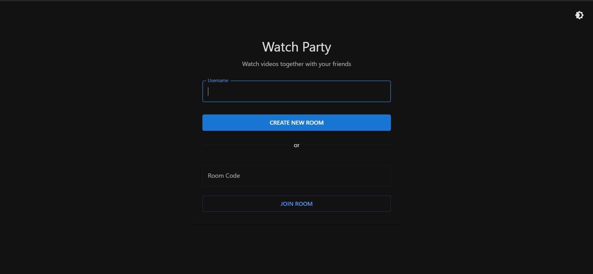
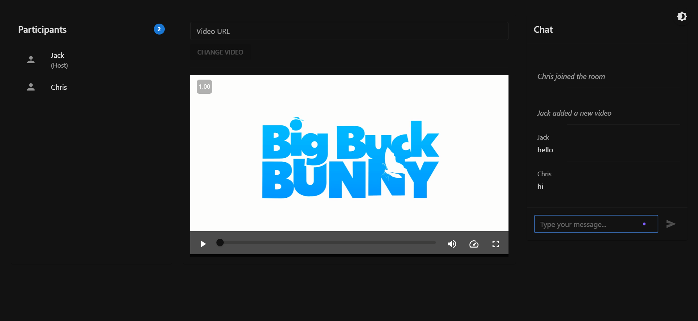

# Watch Party App 🎥

Watch Party is a web application that allows you to watch videos simultaneously with your friends. The application provides a shared movie/video watching experience with your remote friends by synchronizing video playback controls.

## 🚀 Screenshots

### Home Page

*Create a new room or join an existing one*

### Watch Room

*Watch videos together with real-time chat and synchronization*

## 🚀 Features

- ✨ Real-time video synchronization
- 🎮 Synchronization of play, pause, and seek controls
- 💬 Real-time chat
- 🎥 YouTube video support
- 📁 Local video file support
- 🔗 Video URL support
- 👥 Room management and invitation system

## 🛠️ Technologies

- **Frontend:**
  - React.js
  - Material-UI/Tailwind CSS
  - Socket.io-client
  - React Player

- **Backend:**
  - Node.js
  - Express.js
  - Socket.io
  - MongoDB/PostgreSQL

## 🚦 Getting Started

### Requirements

- Node.js (v14 or higher)
- npm or yarn
- MongoDB or PostgreSQL

### Installation

1. Clone the project
```bash
git clone https://github.com/username/watch-party-app.git
cd watch-party-app
```

2. Install dependencies
```bash
npm install
# or
yarn install
```

3. Start the development server
```bash
npm run dev
# or
yarn dev
```

4. Open `http://localhost:3000` in your browser

## 📝 Usage

1. Click "Create Room" button on the home page
2. Share the generated room code with your friends
3. Enter a video URL or upload a local video file
4. Start watching together!

## 🔒 Security

- JWT-based authentication
- Secure WebSocket connections
- XSS and CSRF protection
- Rate limiting

## 🤝 Contributing

1. Fork this project
2. Create a feature branch (`git checkout -b feature/amazing-feature`)
3. Commit your changes (`git commit -m 'feat: Add amazing feature'`)
4. Push your branch (`git push origin feature/amazing-feature`)
5. Create a Pull Request

## 📜 License

This project is licensed under the MIT License. See the [LICENSE](LICENSE) file for details.

## 📞 Contact & Social Media

- **GitHub:** [@mucahit-sahin](https://github.com/mucahit-sahin)
- **Project Repository:** [watch-party-app](https://github.com/mucahit-sahin/watch-party-app)

<div align="center">
  <a href="https://github.com/mucahit-sahin">
    
  </a>
  <a href="https://github.com/mucahit-sahin/watch-party-app">
    
  </a>
</div> 